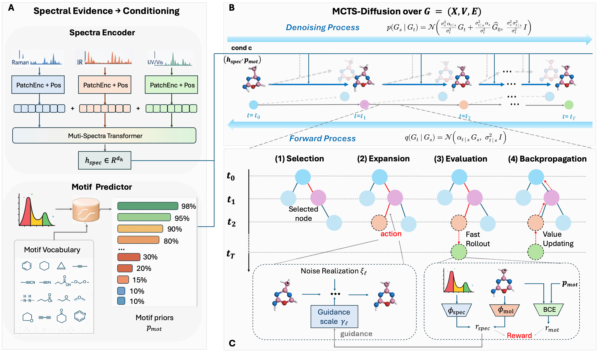

# [ICML 2026] MAST: Motif-Augmented Diffusion with Search Tree for Spectroscopic Molecular Structure Elucidation

Official release code for **MAST: Motif-Augmented Diffusion with Search Tree for Spectroscopic Molecular Structure Elucidation**, accepted to ICML 2026.



MAST is a spectrum-to-structure generation framework that combines multi-spectra conditioning, motif priors, and test-time tree search for molecular structure elucidation.

This repository contains the core pipeline used in the paper:

- motif predictor training (`Emot`)
- motif-augmented diffusion training (`Dθ`)
- diffusion sampling
- MCTS-guided inference


## Repository Layout

- `main.py`: diffusion training and plain sampling entry point
- `train_motif_predictor.py`: motif predictor training
- `sample_mcts.py`: MCTS-guided inference
- `configs/`: paper-oriented configs for QM9SP
- `models/`: denoiser and motif-conditioned model
- `datasets/`: QM9SP dataset loader and transforms
- `spectra/`: SpecFormer encoder used by the denoiser and motif predictor
- `torchmdnet/`: minimal reward-model code needed for MCTS guidance

## Environment

All required Python packages are listed in `requirements.txt`, including the PyG extension packages `torch-scatter`, `torch-sparse`, `torch-cluster`, and `torch-spline-conv`.

Depending on your CUDA and PyTorch build, these PyG dependencies may need the matching wheel source provided by the PyG project.

## Data

The code expects a processed QM9SP dataset rooted at `./data/qm9sp` by default. Paths are configured through environment variables. For processed QM9SP data, please refer to [AzureLeon1/MolSpectra](https://github.com/AzureLeon1/MolSpectra).

```bash
export MAST_DATA_ROOT=/path/to/qm9sp
export MAST_SPLIT_FILE=/path/to/split_dict.pt
```

For motif predictor training, the default motif vocabulary source is `reference/substructure_freq_all.json`. The default threshold is `0.01`, which yields the paper's 103-motif vocabulary.

## Reward Model

MCTS uses two rewards:

- A spectrum-structure similarity reward computed from spectral and molecular representations.
- A motif-consistency reward derived from the predicted motif prior described in the paper.

The spectrum-structure reward follows the training recipe of [AzureLeon1/MolSpectra](https://github.com/AzureLeon1/MolSpectra). 

## Checkpoints

The pretrained checkpoints are publicly available on [Hugging Face](https://huggingface.co/Serendipity001/MAST).

The following files are required for inference:

| Checkpoint | Description |
|---|---|
| `motif_predictor/best_model.pth` | Motif predictor used by the denoising model and the motif-consistency reward. |
| `motif_predictor/substructure_labels.json` | Motif vocabulary required by `best_model.pth`. |
| `mast/qm9sp/checkpoint_80.pth` | MAST checkpoint used for both standard diffusion sampling and MCTS-guided inference. |
| `reward/qm9sp-con_recon-specformer-logx_norm-v3.ckpt` | MolSpectra-style spectral reward model used during MCTS. |


You can set checkpoint paths through environment variables instead of editing source files:

```bash
export MAST_SPECFORMER_CKPT=/path/to/specformer_pretrain.pth
export MAST_BASE_DIFFUSION_CKPT=/path/to/base_spectra_diffusion.pth
export MAST_MOTIF_CKPT=/path/to/motif_predictor.pth
export MAST_REWARD_CKPT=/path/to/molspectra_reward.ckpt
```

## Training

Train the motif predictor:

```bash
python train_motif_predictor.py \
  --config configs/qm9sp_mast.py \
  --output_dir runs/motif_predictor \
  --freq_file reference/substructure_freq_all.json \
  --freq_threshold 0.01
```

Train the motif-augmented diffusion model:

```bash
python main.py \
  --config configs/qm9sp_mast.py \
  --workdir runs/qm9sp_mast \
  --mode train
```

## Inference

Plain diffusion sampling:

```bash
python main.py \
  --config configs/qm9sp_mast.py \
  --workdir runs/qm9sp_mast \
  --mode sample \
  --checkpoint runs/qm9sp_mast/checkpoints/checkpoint_40.pth \
  --output runs/qm9sp_mast/samples/generated.pkl
```

MCTS-guided inference:

```bash
python sample_mcts.py \
  --config configs/qm9sp_mcts.py \
  --checkpoint runs/qm9sp_mast/checkpoints/checkpoint_40.pth \
  --split test \
  --num_samples 128 \
  --output_dir runs/mcts
```

`sample_mcts.py` writes `results.pkl` and `summary.json` under `--output_dir`.


